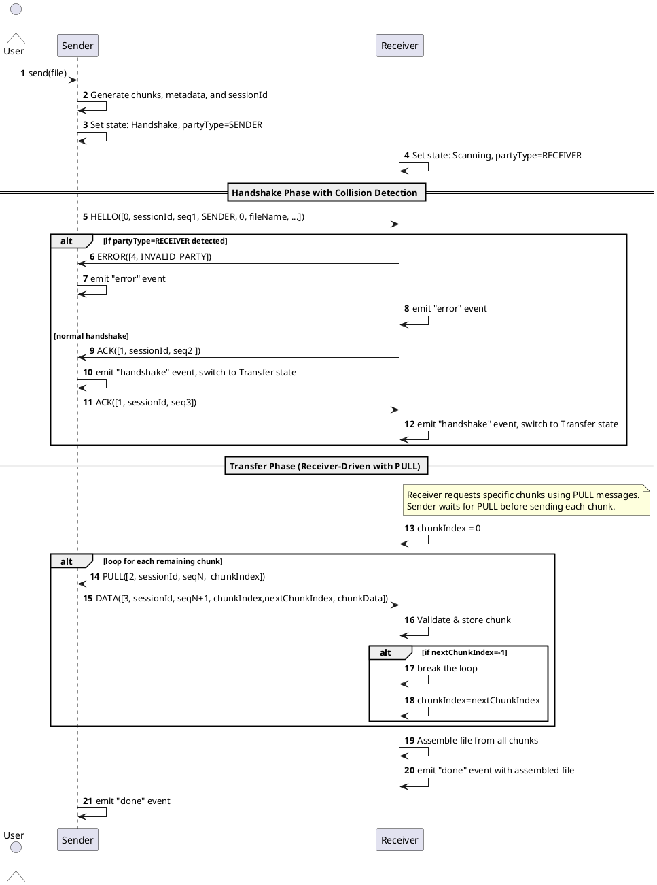

# Beam

- [Beam](#beam)
  - [1. Overview](#1-overview)
  - [2. Core Concepts](#2-core-concepts)
    - [2.1. Parties](#21-parties)
    - [2.2. Message Format](#22-message-format)
    - [2.3. Sequence Numbers](#23-sequence-numbers)
    - [2.4. Chunking](#24-chunking)
    - [2.5. Session ID](#25-session-id)
  - [3. Protocol Flow](#3-protocol-flow)
    - [3.1. Message Types](#31-message-types)
      - [Core Handshake Messages](#core-handshake-messages)
      - [Data Transfer Messages](#data-transfer-messages)
      - [Error](#error)
      - [Message Type Constants](#message-type-constants)
    - [3.2. State Machine](#32-state-machine)
  - [4. Error Handling](#4-error-handling)
  - [5. JavaScript API Implementation](#5-javascript-api-implementation)
    - [Protocol Messages Implementation](#protocol-messages-implementation)
      - [Message Classes](#message-classes)
      - [Message Factory](#message-factory)
      - [Type Definitions](#type-definitions)
      - [Transfer States](#transfer-states)
    - [Original Writer/Reader Interfaces](#original-writerreader-interfaces)
    - [Event Types and Payloads](#event-types-and-payloads)
    - [Options Interface](#options-interface)
    - [Progress and Error Types](#progress-and-error-types)
    - [Promise-Based FileSender API](#promise-based-filesender-api)
    - [Promise-Based FileReceiver API](#promise-based-filereceiver-api)
  - [6. Example Usage (Simplified)](#6-example-usage-simplified)
    - [Basic Usage](#basic-usage)

## 1. Overview

This document outlines the **Beam (QR File Transfer Protocol)**, a simple protocol and accompanying JavaScript library API for transferring files between two parties using QR codes. It is designed for scenarios where traditional network connectivity is unavailable or unreliable.

## 2. Core Concepts

### 2.1. Parties

- A **Sender** initiates the file transfer.
- A **Receiver** accepts the file transfer.
- Both parties require a screen (to display QR codes) and a camera (to scan QR codes).
- For successful transfer, the devices must be aligned so the camera of one device can clearly see the screen of the other.

### 2.2. Message Format

- All messages are MessagePack-serialized tuples using **numeric message types** for maximum efficiency.
- Messages are encoded as compact tuples, then MessagePack serialized, and finally Base64 encoded for QR code display.
- Each message contains a numeric `type` (0-7), `sequence number`, and message-specific fields in fixed positions.
- The encoding pipeline: `Tuple → MessagePack → Base64 → QR Code`

### 2.3. Sequence Numbers

- Sequence numbers are essential for ordering and preventing duplicate message processing.
- Each party maintains its own sequence number counter, starting from a random value.
- When sending a message, a party uses its current sequence number and then increments it.
- Received sequence numbers are validated to ensure messages are not duplicates or out-of-order.
- The protocol supports collision detection when multiple parties of the same type (e.g., two receivers) attempt to connect.

```plantuml
autonumber
participant Sender
participant Receiver

Sender -> Sender: Initialize sequence counter (e.g., `senderSeq=100`)
Receiver -> Receiver: Initialize sequence counter (e.g., `receiverSeq=200`)

Sender -> Receiver: HELLO([0, 100, 0, 210, sessionId, ...])
note right of Receiver: Validate senderSeq=100, store last seen

Receiver -> Sender: HELLO_ACK([1, 200, sessionId, statusCode])
note left of Sender: Validate receiverSeq=200, store last seen

note over Sender, Receiver: Each party increments own sequence for next message
```

### 2.4. Chunking

- Files are split into smaller chunks to fit within QR code capacity.
- The default maximum chunk size is **64 bytes**, optimized for modern QR code readers and error correction.
- Chunk size is configurable based on use case and device capabilities.

### 2.5. Session ID

- Each transfer session is identified by a `session_id` (5 characters, configurable).
- Session IDs are generated using a hash of transferred file name. This allows session's data can be cached an resumed later.
- Session IDs are included in all messages to ensure proper message routing and prevent cross-session interference.

## 3. Protocol Flow

### 3.1. Message Types

The protocol defines 8 message types using numeric identifiers for maximum efficiency:

#### Core Handshake Messages

- **HELLO (0)**: `[0, sessionId, sequenceNumber, partyType, protocolVersion, fileName, fileSize, mimeType,totalChunks, chunkSize]`
- **ACK(1)**: `[1, sessionId, sequenceNumber ]`

#### Data Transfer Messages

- **PULL (2)**: `[2, sessionId, sequenceNumber, chunkIndex]`: Receivers actively pull chunks from senders.
- **DATA (3)**: `[3, sessionId, sequenceNumber, chunkIndex, nextChunkIndex, data]`: Senders response PULL message for a given chunkIndex with DATA ones. If chunkIndex is invalid (e.g out of range), `nextChunkIndex`=-1, `data`=empty. If there's no next chunk, `nextChunkIndex`=-1

#### Error

- **ERROR(4)**: `[4,errorType ]`

#### Message Type Constants

```typescript
enum ProtocolVersion {
  V0 = 0,
}

enum MessageType {
  HELLO = 0,
  ACK = 1,
  PULL = 2,
  DATA = 3,
  ERROR = 4,
}

enum PartyType {
  SENDER = 0,
  RECEIVER = 1,
}

enum ErrorType {
  INVALID_PARTY = 0,
}
```

### 3.2. State Machine

The protocol operates with sophisticated collision detection and receiver-driven data transfer using PULL messages.



## 4. Error Handling

- **Collision Detection:** The protocol detects when multiple parties of the same type attempt to connect and sends ERROR messages.
- **State Validation:** Messages invalid for the current state trigger `error` events with descriptive error codes.
- **Sequence Validation:** Out-of-order or duplicate messages are rejected based on sequence number validation.
- **Graceful Recovery:** Support for transfer resumption using session state and missing chunk detection.

## 5. JavaScript API Implementation

The protocol is implemented through middleware classes that provide clean abstractions over the complex protocol details.

### Protocol Messages Implementation

The protocol defines message classes that implement the `Message` interface and provide type-safe message construction and serialization:

```typescript
interface Message {
  messageType: MessageType;
  toTuple(): any[];
}
```

#### Message Classes

**HelloMessage** - Initiates file transfer handshake:

```typescript
class HelloMessage implements Message {
  constructor(
    public sessionId: string,
    public sequenceNumber: number,
    public partyType: PartyType,
    public protocolVersion: ProtocolVersion,
    public fileName: string,
    public fileSize: number,
    public mimeType: string,
    public totalChunks: number,
    public chunkSize: number
  );
  
  toTuple(): [MessageType.HELLO, string, number, PartyType, ProtocolVersion, string, number, string, number, number];
}
```

**AckMessage** - Acknowledges received messages:

```typescript
class AckMessage implements Message {
  constructor(
    public sessionId: string,
    public sequenceNumber: number
  );
  
  toTuple(): [MessageType.ACK, string, number];
}
```

**PullMessage** - Receiver requests specific chunk:

```typescript
class PullMessage implements Message {
  constructor(
    public sessionId: string,
    public sequenceNumber: number,
    public chunkIndex: number
  );
  
  toTuple(): [MessageType.PULL, string, number, number];
}
```

**DataMessage** - Sender responds with chunk data:

```typescript
class DataMessage implements Message {
  constructor(
    public sessionId: string,
    public sequenceNumber: number,
    public chunkIndex: number,
    public nextChunkIndex: number,
    public data: Uint8Array
  );
  
  toTuple(): [MessageType.DATA, string, number, number, number, Uint8Array];
}
```

**ErrorMessage** - Reports protocol errors:

```typescript
class ErrorMessage implements Message {
  constructor(public errorType: ErrorType);
  
  toTuple(): [MessageType.ERROR, ErrorType];
}
```

#### Message Factory

Messages can be created from tuples using the factory function:

```typescript
function createMessageFromTuple(tuple: any[]): Message {
  // Validates tuple structure and creates appropriate message instance
  // Throws TransferError for invalid message formats
}
```

#### Type Definitions

The implementation includes TypeScript type definitions for all message tuples:

```typescript
type HelloMessageTuple = [MessageType.HELLO, string, number, PartyType, ProtocolVersion, string, number, string, number, number];
type AckMessageTuple = [MessageType.ACK, string, number];
type PullMessageTuple = [MessageType.PULL, string, number, number];
type DataMessageTuple = [MessageType.DATA, string, number, number, number, Uint8Array];
type ErrorMessageTuple = [MessageType.ERROR, ErrorType];

type ProtocolMessageTuple = 
  | HelloMessageTuple 
  | AckMessageTuple 
  | PullMessageTuple 
  | DataMessageTuple 
  | ErrorMessageTuple;
```

#### Transfer States

The protocol maintains transfer state using an enum:

```typescript
enum TransferState {
  IDLE = 'idle',
  HANDSHAKE = 'handshake',
  TRANSFER = 'transfer',
  DONE = 'done',
  ERROR = 'error',
  CANCELLED = 'cancelled',
}
```

### Original Writer/Reader Interfaces

```typescript
interface Writer {
  write(data: string): Promise<void>;
}

interface Reader {
  read(
    onData: (data: string) => void,
    onError: (error: string) => void
  ): Promise<void>;
}
```

### Event Types and Payloads

```typescript
type TransferEvent =
  | "handshake"
  | "ack"
  | "chunk"
  | "pull"
  | "done"
  | "error";

interface HandshakeEvent {
  sessionId: string;
  timestamp: number;
  fileName: string;
  fileSize: number;
  totalChunks: number;
}

interface ChunkEvent {
  sessionId: string;
  timestamp: number;
  chunkIndex: number;
  totalChunks: number;
  data: Uint8Array;
}

interface DoneEvent {
  sessionId: string;
  timestamp: number;
  file?: File; // Receiver only
}

```

### Options Interface

```typescript
interface TransferOptions {
  chunkSize?: number; // Default: 64 bytes
  sessionIdLength?: number; // Default: 5 characters
  enableLogging?: boolean; // Default: false

  // Callback-based event handlers
  onHandshake?: (event: HandshakeEvent) => void;
  onChunk?: (event: ChunkEvent) => void;
  onDone?: (event: DoneEvent) => void;
  onError?: (error: TransferError) => void;
}
```

### Progress and Error Types

```typescript
// Progress information
interface TransferProgress {
  sessionId: string;
  fileName: string;
  fileSize: number;
  currentChunk: number;
  totalChunks: number;
  percentComplete: number;
  transferSpeed: number; // bytes per second
  estimatedTimeRemaining: number; // milliseconds
}

// Error types
class TransferError extends Error {
  code: ErrorCode;
  sessionId?: string;
  details?: any;

  constructor(
    code: ErrorCode,
    message: string,
    sessionId?: string,
    details?: any
  ) {
    super(message);
    this.code = code;
    this.sessionId = sessionId;
    this.details = details;
  }
}

enum ErrorCode {
  PROTOCOL_ERROR = 'protocol_error',
  TIMEOUT = 'timeout',
  INVALID_PARTY = 'invalid_party',
  CONNECTION_LOST = 'connection_lost',
  FILE_TOO_LARGE = 'file_too_large',
  INVALID_CHUNK = 'invalid_chunk',
  SESSION_EXPIRED = 'session_expired',
}
```

### Promise-Based FileSender API

```typescript
class FileSender {
  constructor(writer: Writer, reader: Reader, options?: TransferOptions);

  /**
   * Sends a file to the receiver
   * @param file The file to send
   * @param callbacks Optional progress and error callbacks
   * @returns Promise that resolves when the file is successfully sent
   */
  send(
    file: File,
    callbacks?: {
      onProgress?: (progress: TransferProgress) => void;
    }
  ): Promise<void>;

  /**
   * Cancels the current transfer
   */
  cancel(): Promise<void>;
}
```

### Promise-Based FileReceiver API

```typescript
class FileReceiver {
  constructor(writer: Writer, reader: Reader, options?: TransferOptions);

  /**
   * Starts listening for and receiving a file
   * @param callbacks Optional progress and error callbacks
   * @returns Promise that resolves with the received file
   */
  receive(callbacks?: {
    onProgress?: (progress: TransferProgress) => void;
  }): Promise<File>;

  /**
   * Cancels the current reception
   */
  cancel(): Promise<void>;
}
```

## 6. Example Usage (Simplified)

### Basic Usage

```typescript
import { FileSender, FileReceiver } from '@/lib/beam';

// Sender example
async function sendFile(file) {
  const sender = new FileSender(writer, reader, {
    chunkSize: 64,
    onHandshake: data => {
      console.log(`Handshake established: ${data.sessionId}`);
    },
    onDone: () => {
      console.log('File sent successfully!');
    },
    onError: error => {
      console.error(`Error sending file: ${error.message}`);
    },
  });

  try {
    await sender.send(file, {
      onProgress: progress => {
        updateProgressBar(progress.percentComplete);
      },
    });
    showSuccessMessage('File sent successfully!');
  } catch (error) {
    showErrorMessage(`Transfer failed: ${error.message}`);
  }
}

// Receiver example
async function receiveFile() {
  const receiver = new FileReceiver(writer, reader);

  try {
    const file = await receiver.receive({
      onProgress: progress => {
        updateProgressUI(progress);
      },
    });

    saveOrDisplayFile(file);
  } catch (error) {
    showErrorMessage(`Reception failed: ${error.message}`);
  }
}
```
